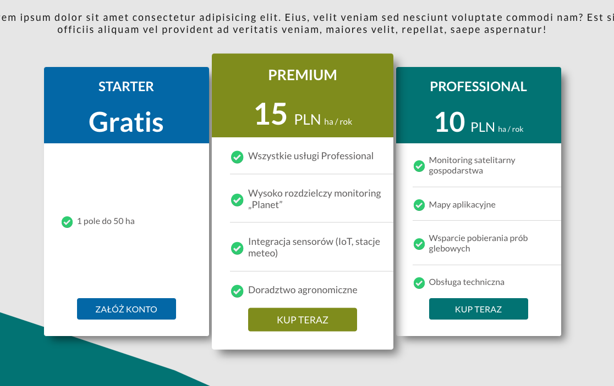
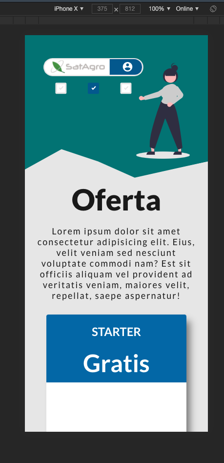
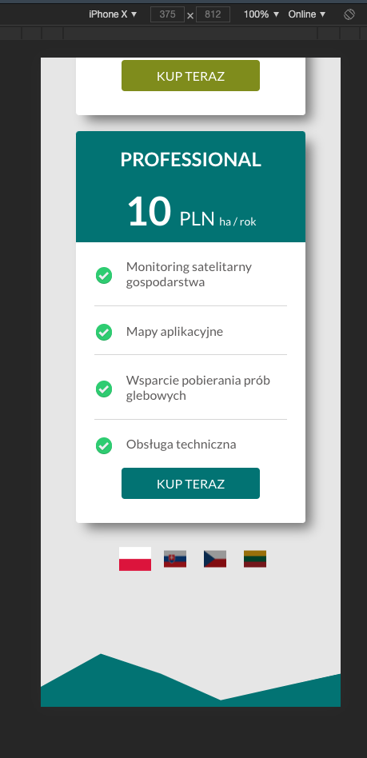

# satagro - price - list

Zadanie rekrutacyjne polegające na napisaniu prostej strony wyświetlającej stronę z ofertą planów abonamentowych. Dane dotyczące planów premium i professional pobierane są z API.

## Technologie i biblioteki użyte w projekcie 🚀

- React
- Typescript
- Scss
- clsx
- https://geolocation-db.com do ustalania lokalizacji użytkownika i ustawienia wstępnej wersji językowej

### Instrukcja uruchomienia

1. Klonujemy repozytorium poleceniem

```
git clone https://github.com/jundymek/satagro-price-list.git
```

2. Wchodzimy do katologu z repozytorium i instalujemy niezbędne zależności

```
npm install lub yarn
```

3. Uruchamiamy stronę

```
npm start lub yarn start
```

## Poniżej kilka przykładowych obrazków

### Desktop:




### Mobile:




### Desktop - błąd wczytywania


### Mobile - błąd wczytywania


